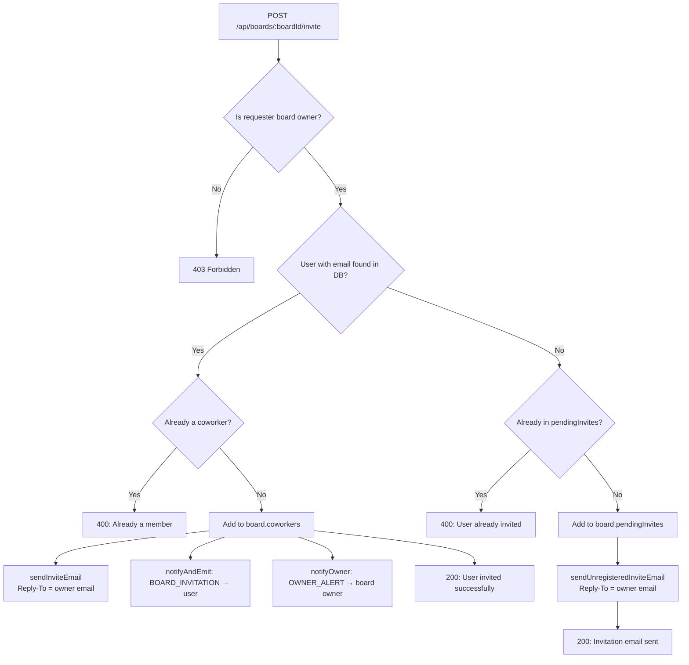
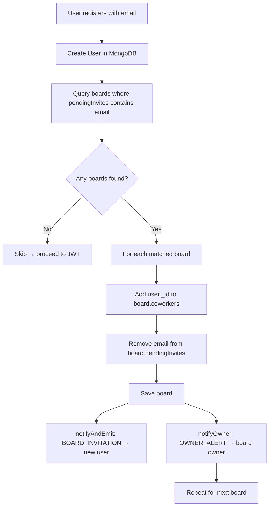

# TaskFlow — Board Invitation & Pending Invite Flow

This document details how TaskFlow handles board invitations for both registered users and those who don't yet have an account.

---

## Overview & Problem Solved

Previously, inviting a collaborator required them to already have a TaskFlow account. Inviting any unregistered email resulted in a `404 User Not Found` error.

With the **Pending Invitations Flow**, board owners can invite **any email address**:
- If the email belongs to a **registered user** → they are added to the board immediately
- If the email is **unregistered** → their email is held as a pending invite and they receive a sign-up invitation email
- Once they register with that email address → the system **auto-joins** them to all pending boards and notifies the board owners

---

## Scenario A: Invited User is Already Registered

**Steps:**

1. Board owner enters the coworker's email in the invite form
2. Backend finds the user in the database
3. User is immediately added to `board.coworkers`
4. Invite email is sent (with `Reply-To` set to the owner's email)
5. `BOARD_INVITATION` notification is sent to the invited user (real-time via Socket.IO)
6. `OWNER_ALERT` notification is sent to the board owner

**API Response:**
```json
{
  "message": "User invited successfully",
  "coworkers": ["<userId1>", "<userId2>"]
}
```

---

## Scenario B: Invited User is NOT Yet Registered

**Steps:**

1. Board owner enters an email not found in the database
2. Backend adds the email to `board.pendingInvites[]`
3. A branded sign-up invitation email is sent to that address (with `Reply-To` = owner's email)
4. The invited person clicks the link, visits TaskFlow, and registers with that exact email

**Upon registration** (`POST /api/auth/register`), the backend:
1. Queries all boards where `pendingInvites` contains the new user's email
2. For each matched board:
   - Adds `user._id` to `board.coworkers[]`
   - Removes the email from `board.pendingInvites[]`
   - Saves the board
   - Creates a `BOARD_INVITATION` notification → new user (real-time via Socket.IO)
   - Creates an `OWNER_ALERT` notification → board owner (real-time via Socket.IO)

---

## Technical Flow

### Invitation Endpoint (`POST /api/boards/:boardId/invite`)



### Registration Auto-Join (`POST /api/auth/register`)



---

## Board Schema — `pendingInvites` Field

```javascript
// models/Board.js
pendingInvites: [
  {
    type: String,
    trim: true,
    lowercase: true  // stored in lowercase to prevent case-sensitivity issues
  }
]
```

**Important:** When comparing emails during registration, both sides are lowercased:
```javascript
const cleanEmail = email.trim().toLowerCase();
const boardsWithPendingInvites = await Board.find({ pendingInvites: cleanEmail });
```

---

## Email Behaviour

| Email Type | Sent When | Template | Reply-To |
|---|---|---|---|
| `sendInviteEmail` | Registered user invited | `inviteTemplate` | Board owner's email |
| `sendUnregisteredInviteEmail` | Unregistered email invited | `inviteUnregisteredTemplate` | Board owner's email |

Both emails are sent from the platform SMTP account (`EMAIL_USER`) but the `Reply-To` header is set to the board owner's email address, so any reply from the recipient goes directly to the owner.

---

## Error Cases

| Scenario | HTTP Status | Error Message |
|---|---|---|
| Requester is not board owner | 403 | `"Only the board owner can invite members"` |
| Email is already an active coworker | 400 | `"User is already a member of this board"` |
| Email is already in pendingInvites | 400 | `"An invitation has already been sent to this email"` |
| SMTP failure | Non-fatal | Logged to server console; board state unchanged |

---

## SMTP Notes

- **Gmail App Password Required:** `EMAIL_PASS` must be a 16-character App Password, not your normal Gmail password. Remove all spaces from the code before pasting it into `.env`.
- **Reply-To Header:** Replies go directly to the board owner, not to the platform email address.

See [`email-service.md`](./email-service.md) for complete SMTP setup instructions.
