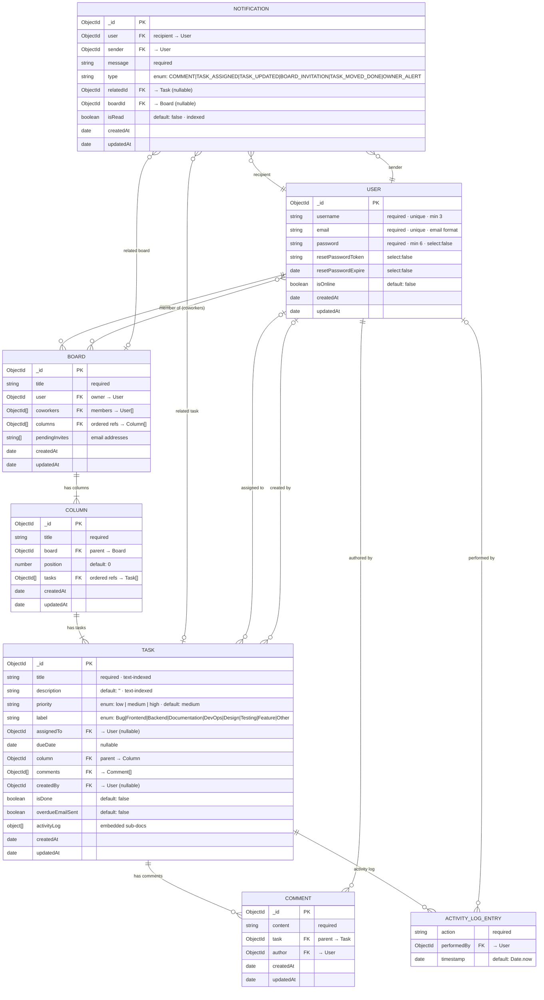

# TaskFlow — Database Schema

> **MongoDB / Mongoose** — Entity-Relationship Diagram  
> All `ObjectId` references are shown as foreign-key relationships.  
> `timestamps: true` adds `createdAt` and `updatedAt` to every collection.

---

## Entity-Relationship Diagram

---

## Collections Summary

| Collection | Documents | Key Relationships |
|---|---|---|
| `users` | Auth accounts | Referenced by all other collections |
| `boards` | Kanban boards | Owned by 1 User · many coworkers · many Columns |
| `columns` | Board lanes | Belongs to 1 Board · ordered by `position` |
| `tasks` | Work items | Belongs to 1 Column · assigned to 1 User · has Comments |
| `comments` | Task comments | Belongs to 1 Task · authored by 1 User |
| `notifications` | In-app alerts | Recipient + Sender are Users · links to Task/Board |

---

## Indexes

| Collection | Field(s) | Type | Purpose |
|---|---|---|---|
| `boards` | `user` | Single | Fast lookup of boards by owner |
| `columns` | `board` | Single | Fast lookup of columns by board |
| `tasks` | `column` | Single | Fast lookup of tasks by column |
| `tasks` | `title`, `description` | Text (compound) | Full-text search across tasks |
| `comments` | `task` | Single | Fast lookup of comments by task |
| `notifications` | `user` | Single | Fast lookup of notifications by recipient |
| `notifications` | `isRead` | Single | Fast filtering of unread notifications |

---

## Notification Types

| Type | Trigger |
|---|---|
| `COMMENT` | A comment is posted on a task |
| `TASK_ASSIGNED` | A task is assigned to a user |
| `TASK_UPDATED` | Task details are modified |
| `BOARD_INVITATION` | A user is invited to a board |
| `TASK_MOVED_DONE` | A task is moved to a "done" column |
| `OWNER_ALERT` | Board owner receives an alert (e.g. overdue) |

---

## Task Labels & Priority

**Priority** `low` · `medium` *(default)* · `high`

**Labels** `Bug` · `Frontend` · `Backend` · `Documentation` · `DevOps` · `Design` · `Testing` · `Feature` · `Other`
