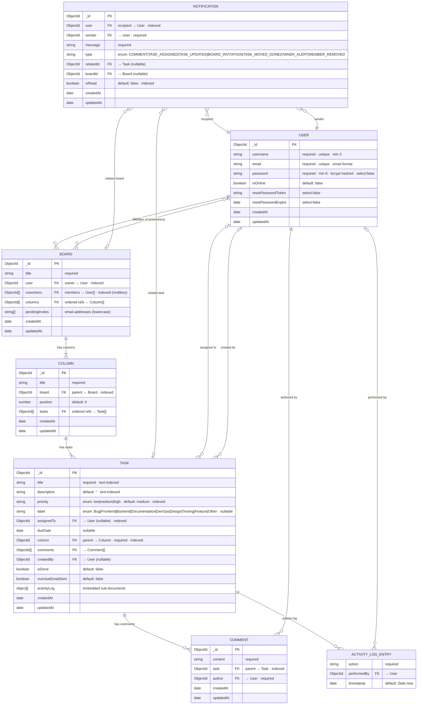

# TaskFlow — Database Schema

> **MongoDB / Mongoose**  
> All `ObjectId` references are shown as foreign-key relationships.  
> `timestamps: true` adds `createdAt` and `updatedAt` to every collection.

---

## Entity-Relationship Diagram

---

## Collections Summary

| Collection | Documents | Key Relationships |
|---|---|---|
| `users` | Auth accounts & profiles | Referenced by all other collections |
| `boards` | Kanban boards | Owned by 1 User · N coworkers · N Columns |
| `columns` | Board lanes / swim lanes | Belongs to 1 Board · ordered by `position` |
| `tasks` | Work items | Belongs to 1 Column · assigned to 1 User · has N Comments |
| `comments` | Task discussions | Belongs to 1 Task · authored by 1 User |
| `notifications` | In-app alerts | Recipient + Sender are Users · links to Task and/or Board |

---

## Indexes

| Collection | Field(s) | Index Type | Query Optimised |
|---|---|---|---|
| `boards` | `user` | Single | Dashboard: boards owned by user |
| `boards` | `coworkers` | Multikey | Dashboard: boards where user is a member |
| `columns` | `board` | Single | Board page: fetch columns by board |
| `tasks` | `column` | Single | Column view: fetch tasks by column |
| `tasks` | `title`, `description` | Text (compound) | Full-text task search |
| `tasks` | `assignedTo` | Single | Filter: tasks assigned to a user |
| `tasks` | `priority` | Single | Filter: tasks by priority level |
| `comments` | `task` | Single | Fetch all comments for a task |
| `notifications` | `user` | Single | Fetch notifications for a recipient |
| `notifications` | `isRead` | Single | Filter unread notifications |

---

## Notification Types

| Type | Trigger |
|---|---|
| `COMMENT` | A comment is posted on a task |
| `TASK_ASSIGNED` | A task is assigned or reassigned to a user |
| `TASK_UPDATED` | Task details (title, priority, etc.) are modified |
| `BOARD_INVITATION` | A user is invited to or auto-joined a board |
| `TASK_MOVED_DONE` | A task is moved into a column with "done" in its name |
| `OWNER_ALERT` | Board owner receives an alert (member joined, column added) |
| `MEMBER_REMOVED` | A coworker is removed from a board |

---

## Task Labels & Priority

**Priority** `low` · `medium` *(default)* · `high`

**Labels** `Bug` · `Frontend` · `Backend` · `Documentation` · `DevOps` · `Design` · `Testing` · `Feature` · `Other`

---

## Schema Validation Notes

- `Board.pendingInvites` stores emails in lowercase (enforced by schema `lowercase: true` + `trim: true`)
- `Task.column` is a **required** back-reference — every task must always belong to exactly one column
- `Task.overdueEmailSent` is set to `true` by the cron job after sending the first overdue alert, preventing repeated daily emails
- `User.isOnline` is managed exclusively by Socket.IO connection/disconnect events — never set manually in controllers
