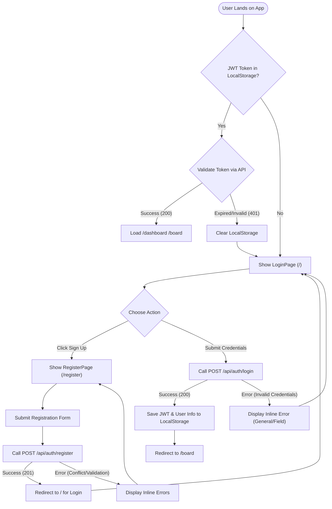
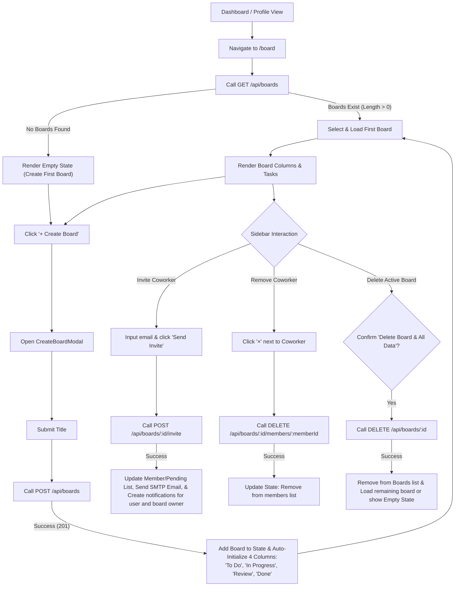
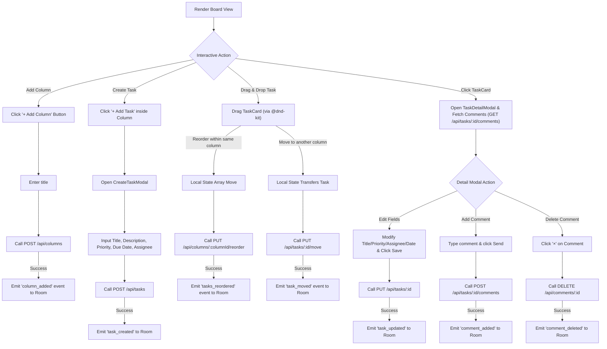
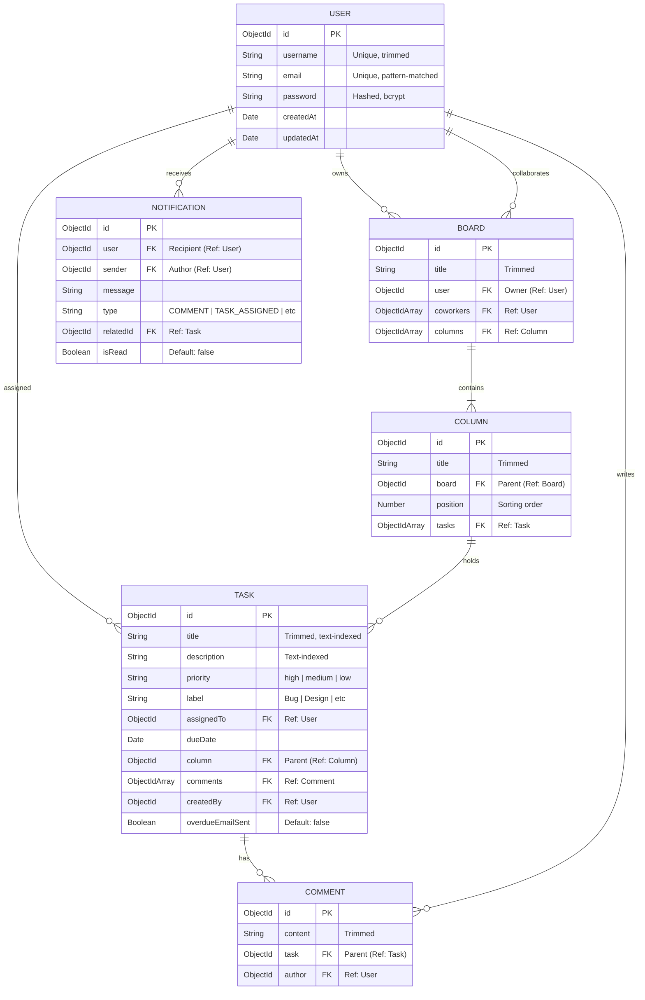

# ⚡ TaskFlow User Flow & Architecture Blueprint

TaskFlow is a real-time collaborative Kanban project management application designed for fast, seamless, and high-fidelity team coordination. This document details the end-to-end user flows, interactive states, real-time socket events, and front-to-back integration pathways.

---

## 👥 1. User Roles & Permissions

TaskFlow supports two primary roles per project board, enforcing clear access control throughout the entire task lifecycle.

| Role | Description | Core Capabilities | Permissions |
| :--- | :--- | :--- | :--- |
| **Board Owner** | The creator of the project board. | Full administrative control. | • Create / Delete Board<br>• Create / Rename / Delete Columns<br>• Invite / Remove Coworkers<br>• Full Task Management |
| **Board Coworker** | An invited collaborator on the board. | Interactive board member. | • View Board & Members<br>• Create / Modify / Move / Reorder Tasks<br>• Add / Delete Comments |

---

## 🔄 2. Core User Flows (Visualized)

### A. Authentication & Session Flow
This flow manages user identity validation, secure token registration, and session persistence.



---

### B. Board & Workspace Lifecycle Flow
This flow tracks how a user interacts with the sidebar, initializes new workspaces, invites teammates, or deletes boards.



---

### C. Kanban Board: Task & Column Interaction Flow
Tracks how elements within a loaded board are updated, reordered, and synced in real-time.



---

## ⚡ 3. Real-Time Socket Events Architecture

TaskFlow uses a bidirectional event-driven layer powered by **Socket.io** to provide immediate, zero-latency visual synchronization for all active board collaborators.

```
       [ Collaborator A ]                                     [ Backend Server ]                                     [ Collaborator B ]
               │                                                      │                                                      │
               │  ─── Emit: join_board (boardId) ──────────────────>  │                                                      │
               │                                                      │  <─── Emit: join_board (boardId) ──────────────────  │
               │                                                      │                                                      │
               │                                                      │                                                      │
               │  ─── Drag-and-drop: moveTask() ────────────────────>  │                                                      │
               │                                                      │  ─── Broadcast: "task_moved" ──────────────────────> │
               │                                                      │      (taskId, sourceColumnId, destColumnId)          │  [Task automatically moves
               │                                                      │                                                      │   in Collaborator B's UI]
               │                                                      │                                                      │
               │  ─── Add Comment: addComment() ────────────────────> │                                                      │
               │                                                      │  ─── Broadcast: "comment_added" ───────────────────> │
               │                                                      │      (taskId, commentPayload)                        │  [Comment renders in
               │                                                      │                                                      │   Collaborator B's modal]
```

### Supported Websocket Protocol Directory

| Event Name | Sent From | Payload Structure | Description |
| :--- | :--- | :--- | :--- |
| `join_board` | Client → Server | `boardId` | Authenticated client joins a dedicated socket room matching the current active board ID. |
| `leave_board` | Client → Server | `boardId` | Client disconnects or exits the active board room to prevent stale background updates. |
| `task_created` | Server → Client | `{ columnId, task, createdBy }` | Emitted when a teammate creates a new task; cards appear instantly. |
| `task_updated` | Server → Client | `{ taskId, updatedTask }` | Broadcasts changes to task properties (labels, titles, assignees, priorities). |
| `task_moved` | Server → Client | `{ taskId, sourceColumnId, destinationColumnId }` | Syncs task card movement across different board columns in real-time. |
| `tasks_reordered` | Server → Client | `{ columnId, taskIds }` | Broadcasts reordering of task cards within a single vertical column. |
| `columns_reordered`| Server → Client | `{ columnIds }` | Broadcasts column reordering across the board layout. |
| `column_added` | Server → Client | `{ column }` | Emitted when a new vertical list is created on the board. |
| `column_deleted` | Server → Client | `{ columnId }` | Emitted when a column (and its tasks) are deleted. |
| `comment_added` | Server → Client | `{ taskId, comment }` | Appends a collaborator's comment inside the task detail pane live. |
| `comment_deleted` | Server → Client | `{ taskId, commentId }` | Removes a comment instantly for all users viewing that task. |

---

## 📊 4. Authenticated Pages & Navigation Tree

Once signed in, the user interacts with the application via a responsive multi-page UI managed by `React Router`.

```
                  ┌───────────────┐
                  │   LoginPage   │ (/)
                  └───────┬───────┘
                          │ (Sign In / Register)
                  ┌───────▼───────┐
                  │ RegisterPage  │ (/register)
                  └───────┬───────┘
                          │ (Register Success)
                  ┌───────▼───────┐
                  │   BoardPage   │ (/board) ─── [Core workspace interface]
                  └───────┬───────┘
                          │
         ┌────────────────┼────────────────┐
         ▼                ▼                ▼
┌─────────────────┐ ┌───────────┐ ┌─────────────────┐
│  DashboardPage  │ │  Navbar   │ │   ProfilePage   │
│   (/dashboard)  │ │ Component │ │    (/profile)   │
└─────────────────┘ └─────┬─────┘ └─────────────────┘
                          │
            ┌─────────────┴─────────────┐
            ▼                           ▼
┌──────────────────────┐    ┌──────────────────────┐
│  ThemeContext Toggle │    │ Notifications Bell   │
│  (Dark / Light Mode) │    │ (Dropdown Actions)   │
└──────────────────────┘    └──────────────────────┘
```

### Page Capabilities & Data Flow

#### 1. BoardPage (`/board`)
*   **Purpose:** The central collaboration dashboard.
*   **Flows:**
    1. Fetches all accessible boards from `GET /api/boards`.
    2. Selected board triggers parallel fetch requests: Board Details (`GET /api/boards/:id`) and Coworkers (`GET /api/boards/:id/members`).
    3. Auto-registers Socket.io room connection to receive remote board modifications.
    4. Provides interactive column reordering, task dragging, and search filtering (priority, search string, assignee, due date) without full-page reloads.

#### 2. DashboardPage (`/dashboard`)
*   **Purpose:** Aggregates workspace data into beautiful visual charts and status cards.
*   **Flows:**
    1. Fetches overall boards lists and iterates details for the active board.
    2. Calculates live analytical stats:
        *   **Total Tasks:** Count of all tasks across columns.
        *   **In Progress:** Count of tasks inside progress columns.
        *   **Completed:** Count of tasks inside the 'Done' column.
        *   **High Priority:** Count of tasks marked 'high'.
        *   **Overdue & Due Soon:** Time-based calculations matching the current client date.
        *   **XP & Streak:** Gamified metrics calculating task completion rates and active day participation.
    3. Renders two dynamic charting engines:
        *   *Bar Chart:* Tasks per Column.
        *   *Pie Chart:* Tasks by Priority.
    4. Renders a filterable table listing all workspace tasks with complete meta properties (priority, column state, assignee, due dates).

#### 3. ProfilePage (`/profile`)
*   **Purpose:** Account settings overview and global user activity statistics.
*   **Flows:**
    1. Retrieves account credentials from local storage.
    2. Runs `GET /api/profile/boards` to calculate complete workspace statistics:
        *   Total active boards.
        *   Overall tasks assigned/created.
        *   Overall completed tasks.
        *   High-priority task load.
    3. Renders the interactive "My Boards" table allowing one-click redirection back to `/board`.
    4. Allows safe account logout, clearing JWT credentials and local cache, and returning the user to the unauthenticated Landing View (`/`).

---

## 🗄️ 5. Database Schemas & Relations (ERD)

TaskFlow uses a highly structured relational document schema in MongoDB managed via Mongoose. The following Entity-Relationship Diagram outlines the operational data connections:



---

## 🛡️ 6. API Validation & Payload Schemas (Zod vs DB)

TaskFlow validates all input payloads at the HTTP request boundary via **Zod** middleware before database transaction models execute. This ensures a clean separation between data transfer objects (DTO) and DB schema definitions.

### A. Authentication Schemas

#### DB Schema definition (`User.js`)
*   `username`: { type: String, required: true, unique: true, trim: true, minlength: 3 }
*   `email`: { type: String, required: true, unique: true, match: EmailRegex }
*   `password`: { type: String, required: true, minlength: 6, select: false }

#### Zod Request Validation Schema (`authValidator.js`)
*   **Register Request (`createRegisterSchema`):**
    ```javascript
    z.object({
      body: z.object({
        name: z.string().min(1, "Full name is required"), // maps to username
        email: z.string().email("Invalid email address"),
        password: z.string().min(6, "Password must be at least 6 characters"),
      })
    })
    ```
*   **Login Request (`createLoginSchema`):**
    ```javascript
    z.object({
      body: z.object({
        email: z.string().email("Invalid email address"),
        password: z.string().min(1, "Password is required"),
      })
    })
    ```

---

### B. Board & Workspace Schemas

#### DB Schema definition (`Board.js`)
*   `title`: { type: String, required: true, trim: true }
*   `user`: { type: ObjectId, ref: 'User', required: true, index: true }
*   `coworkers`: [{ type: ObjectId, ref: 'User' }]
*   `columns`: [{ type: ObjectId, ref: 'Column' }]

#### Zod Request Validation Schema (`boardValidator.js`)
*   **Create Board (`createBoardSchema`):**
    ```javascript
    z.object({
      body: z.object({
        title: z.string().min(1, "Board title is required"),
      })
    })
    ```
*   **Invite Member (`inviteMemberSchema`):**
    ```javascript
    z.object({
      body: z.object({
        email: z.string().email("Invalid email address"),
      })
    })
    ```

---

### C. Column Schemas

#### DB Schema definition (`Column.js`)
*   `title`: { type: String, required: true, trim: true }
*   `board`: { type: ObjectId, ref: 'Board', required: true, index: true }
*   `position`: { type: Number, default: 0 }
*   `tasks`: [{ type: ObjectId, ref: 'Task' }]

#### Zod Request Validation Schema (`columnValidator.js`)
*   **Create Column (`createColumnSchema`):**
    ```javascript
    z.object({
      body: z.object({
        title: z.string().min(1, "Column title is required"),
        boardId: z.string().regex(/^[0-9a-fA-F]{24}$/, "Invalid Board ID"),
      })
    })
    ```
*   **Reorder Columns (`reorderColumnsSchema`):**
    ```javascript
    z.object({
      body: z.object({
        columnIds: z.array(z.string().regex(/^[0-9a-fA-F]{24}$/, "Invalid Column ID")),
      })
    })
    ```

---

### D. Task Schemas

#### DB Schema definition (`Task.js`)
*   `title`: { type: String, required: true, trim: true }
*   `description`: { type: String, default: "" }
*   `priority`: { type: String, enum: ['low', 'medium', 'high'], default: 'medium' }
*   `label`: { type: String, enum: ['Bug', 'Frontend', 'Backend', 'Documentation', 'DevOps', 'Design', 'Testing', 'Feature', 'Other'], default: null }
*   `assignedTo`: { type: ObjectId, ref: 'User', default: null }
*   `dueDate`: { type: Date, default: null }
*   `column`: { type: ObjectId, ref: 'Column', required: true, index: true }
*   `comments`: [{ type: ObjectId, ref: 'Comment' }]
*   `createdBy`: { type: ObjectId, ref: 'User' }
*   `overdueEmailSent`: { type: Boolean, default: false } (tracks whether an overdue email has already been dispatched)
*   *Compound Index:* `{ title: 'text', description: 'text' }` for task search filters.

#### Zod Request Validation Schema (`taskValidator.js`)
*   **Create Task (`createTaskSchema`):**
    ```javascript
    z.object({
      body: z.object({
        title: z.string().min(1, "Task title is required"),
        columnId: z.string().regex(/^[0-9a-fA-F]{24}$/, "Invalid Column ID"),
        description: z.string().optional(),
        priority: z.enum(["low", "medium", "high"]).default("medium"),
        label: z.enum(["Bug", "Frontend", "Backend", "Documentation", "DevOps", "Design", "Testing", "Feature", "Other"]).nullable().optional(),
        dueDate: z.string().datetime().nullable().optional(),
        assignedTo: z.string().regex(/^[0-9a-fA-F]{24}$/, "Invalid User ID").nullable().optional(),
      })
    })
    ```
*   **Move Task (`moveTaskSchema`):**
    ```javascript
    z.object({
      body: z.object({
        taskId: z.string().regex(/^[0-9a-fA-F]{24}$/, "Invalid Task ID"),
        sourceColumnId: z.string().regex(/^[0-9a-fA-F]{24}$/, "Invalid Source Column ID"),
        destinationColumnId: z.string().regex(/^[0-9a-fA-F]{24}$/, "Invalid Destination Column ID"),
      })
    })
    ```

---

## 🔒 7. Data Cascade & Reference Integrity Rules

To enforce database consistency and prevent broken references, TaskFlow implements atomic business rules across models during the API lifecycle:

1.  **Board Deletion Cascade:**
    When a Board is deleted (`DELETE /api/boards/:id`):
    *   All child Columns linked to the board are queried and permanently removed.
    *   All child Tasks mapped to those columns are queried and permanently removed.
    *   All associated Comments are swept and deleted.
2.  **Column Deletion Cascade:**
    When a Column is deleted (`DELETE /api/columns/:id`):
    *   The Column pointer inside the Board `columns` list is removed.
    *   All Tasks belonging to that column are permanently removed.
3.  **Task Deletion Synchronization:**
    When a Task is deleted (`DELETE /api/tasks/:id`):
    *   *Authorization:* Restricted to the Board Owner only. Coworkers attempting this receive a `403 Forbidden` response.
    *   The parent Column updates its `tasks` array to pull the Task ObjectID.
    *   All Comments pointing to the Task are removed.

---

> [!NOTE]
> All secure backend routes require the JWT token to be injected into the request header as `Authorization: Bearer <token>`. Unauthorized requests automatically clear the local session and redirect users to the login screen.
